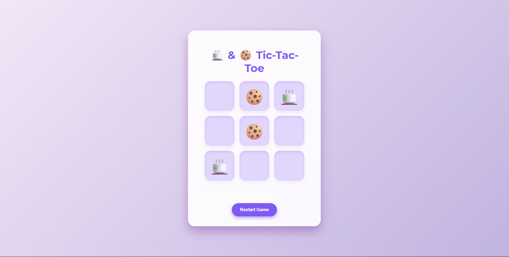

<!-- Hero Section: Banner -->

  

<!-- About Me -->
## 👋 About Me

Code, chai, and curiosity — that's how I roll. I love building things that work smart and look sharp.

 

 💻 <strong>Full Stack Developer</strong>  
 🧠 Learning <strong>Machine Learning</strong>  
 💼 Intern at <strong>SSPL–DRDO</strong>  
 ☕ Prefer <strong>Java</strong>, also familiar with other languages  
 🚀 Built projects in ML & Web Development  

## 🧠 Live GitHub Stats  

 

  <!-- Top languages and contributions graph -->
    
  

 

## 🍵 Today’s Chai Thought  

  “We are all in the gutter, but some of us are looking at the stars. ” — Oscar Wilde

## 🔗 Connect & Code 💻☕✨

  
    
  
  
    
  
  
    
  

## 🕹️ Mini Tic-Tac-Toe Challenge!  

  Put your strategy to the test with my fun little game:  
  <a href="https://riyagupta2230.github.io/tic-tac-toe-chai-biscuit/" target="_blank" style="text-decoration: none; font-weight: 700; color: #7f5af0;">Tic-Tac-Toe: Chai & Biscuit Edition ☕🍪</a>

  

  A game crafted with love, chai vibes, and a pinch of coding magic. Can you beat the biscuits? 🏆

## 🛠️ Tech & Tools

## 📂 Featured ML Projects

| 🚀 Project              | 📝 Description                                                                                         | 🔗 Repo Link                                                                                               |
|------------------------|------------------------------------------------------------------------------------------------------|------------------------------------------------------------------------------------------------------------|
| **RealTime‑ASL**       | Deep‐learning–based ASL recognition, achieving **98.46%** accuracy with integrated text‑to‑speech support for seamless communication. | [github.com/RiyaGupta2230/RealTime‑ASL‑Recognition](https://github.com/RiyaGupta2230/RealTime-ASL-Recognition) 
| **Sentiment Analyzer** | In‑house Python & ML‑powered sentiment analysis engine; leverages diverse data sources to continuously improve accuracy and surface deeper insights. | [github.com/RiyaGupta2230/Sentiment‑Analyzer](https://github.com/RiyaGupta2230/Sentiment-Analyzer-)   |

