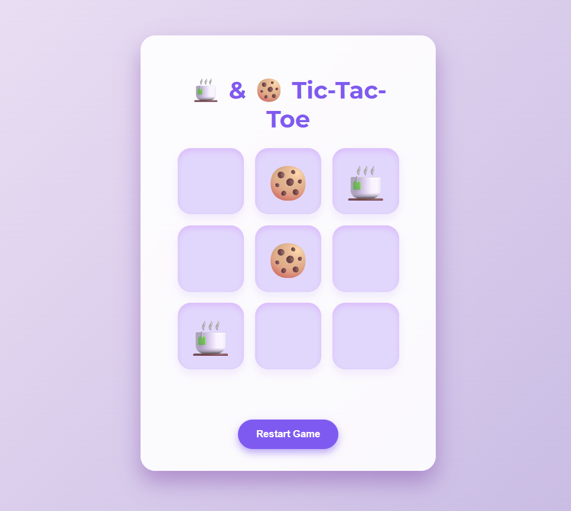

<!-- Hero Section: Banner -->

  

<!-- About Me -->
## 👋 About Me

**Name:** _Riya Gupta_  
**Location:** _Noida, Uttar Pradesh, India_  
**Role:** _Code Alchemist & ML Enthusiast_

**Bio:**  
I brew lines of code as passionately as I brew chai — each project a new flavor, each bug a hidden ingredient. With a curious mind and a hint of **digital sorcery**, I stir creativity, logic, and a bit of magic into every solution. Forever learning, always evolving, and crafting code that’s as warm and bold as a fresh cup of chai.  

⚠️ *Warning:* Prolonged interaction may cause inspiration, sudden curiosity, and uncontrollable desire to debug the universe. ☕✨

## 🧠 Live GitHub Stats  

  

  <!-- Top languages and contributions graph -->
    
  

---

## 🕹️ Mini Tic-Tac-Toe Challenge!  

  Put your strategy to the test with my fun little game:  
  <a href="https://riyagupta2230.github.io/tic-tac-toe-chai-biscuit/" target="_blank" style="text-decoration: none; font-weight: 700; color: #7f5af0;">Tic-Tac-Toe: Chai & Biscuit Edition ☕🍪</a>

  

  A game crafted with love, chai vibes, and a pinch of coding magic. Can you beat the biscuits? 🏆

---

## 🛠️ Tech & Tools

  
      
  
      
  
      
  

---

## 📂 Featured ML Projects

| 🚀 Project              | 📝 Description                                                                                         | 🔗 Repo Link                                                                                               |
|------------------------|------------------------------------------------------------------------------------------------------|------------------------------------------------------------------------------------------------------------|
| **RealTime‑ASL**       | Deep‐learning–based ASL recognition, achieving **98.46%** accuracy with integrated text‑to‑speech support for seamless communication. | [github.com/RiyaGupta2230/RealTime‑ASL‑Recognition](https://github.com/RiyaGupta2230/RealTime-ASL-Recognition) 
| **Sentiment Analyzer** | In‑house Python & ML‑powered sentiment analysis engine; leverages diverse data sources to continuously improve accuracy and surface deeper insights. | [github.com/RiyaGupta2230/Sentiment‑Analyzer](https://github.com/RiyaGupta2230/Sentiment-Analyzer-)  

